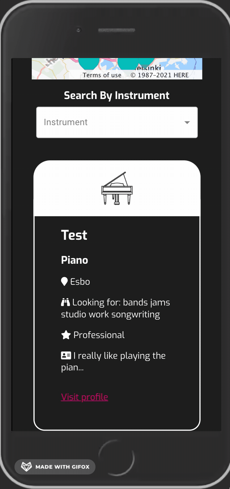

This project was bootstrapped with [Create React App](https://github.com/facebook/create-react-app).

# Bandmate Finder
A social media app created for musicians.
Users can create profiles, and connect with other users by commenting on their profiles.

The users address is geocoded on the backend when signing up based on city and postal code, and the coordinates are stored to MongoDB along with the other information. You can filter users on the map so only users playing a certain instrument are shown.

Technologies: React, Node, Express, mongoDB, Here Maps, Bcrypt for salting and hashing passwords, Node geocoder.

Backend and frontend on different repositories, both deployed to Heroku.

To run the project:

```bash
npm install
npm start
```



